## Getting Started
### Overview
 1. [Install neo4j desktop](https://neo4j.com/docs/desktop-manual/current/installation/download-installation/)
 2. Clone this repository
 3. Collect data to add to your graph using 'ecosyst.ms-api.py'
 4. Import data into neo4j using 'import-db-neo4j'
 5. Query and visualize with neo4j Bloom

 ### Start data collection 
  1. Go to [ecosyst.ms](https://papers.ecosyste.ms/) and choose a project to analyze
> Try to find one under 200 mentions for the first try, then go larger
  2. Find the project's api url by trying out the ['/projects/{ecosystem}/{name}' query](https://papers.ecosyste.ms/docs/index.html)

  3. Open your terminal, navigate to the repository directory (or scripts) and run 'ecosyst.ms-api.py' with 'python3'

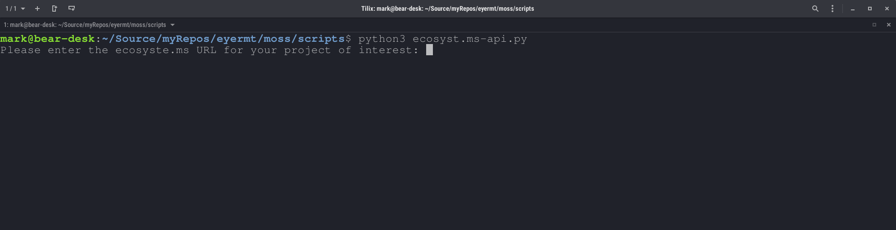

  4. Paste the 'Request URL' as the URL of interest; choose y, its more interesting but takes a little longer

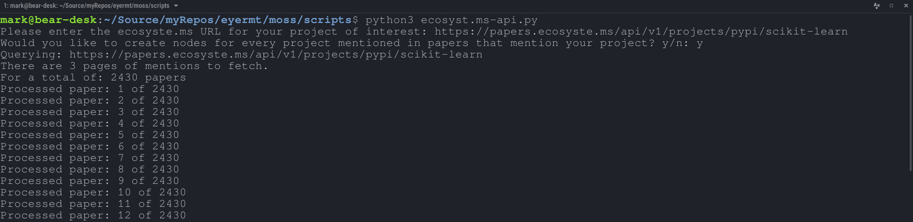

  5. Once this is done you will have a csv file to import into neo4j

 ### Install & setup neo4j desktop
  1. [Install neo4j desktop](https://neo4j.com/docs/desktop-manual/current/installation/download-installation/)
  
  2. Add a local DBMS to your project
  
  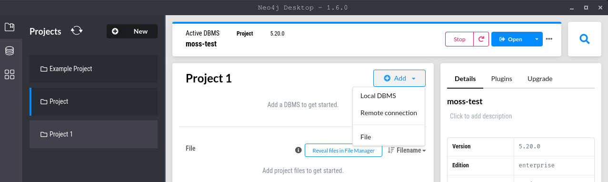
  
  3. Name it anything, remember the password, press 'create'

  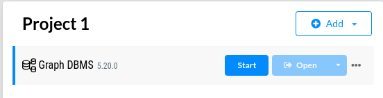

  4. Edit the settings in the 3 dot menu to the right of your DBMS: uncomment 'dbms.security.allow_csv_import_from_file_urls=true'

  
  
  5. Start it and observe the 'Bolt port' 

  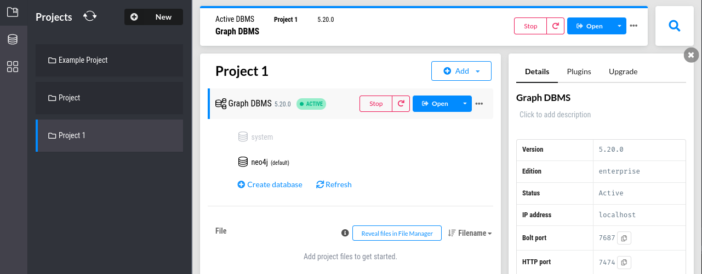

  
  6. Open the Browser app

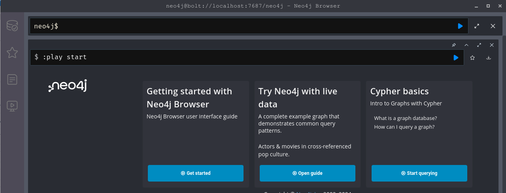

 ### Import your data to the graph database
  1. Open the import folder in your local filesystem

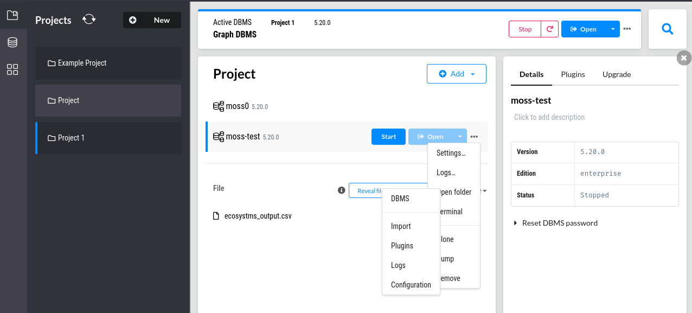
  
  2. Copy the csv file created by the 'ecosyst.ms-api.py' script into the import directory

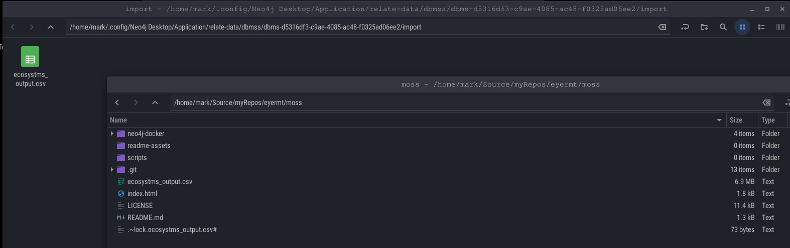

  3. Copy the contents of 'import-db-neo4j' and paste into the shell in the browser app

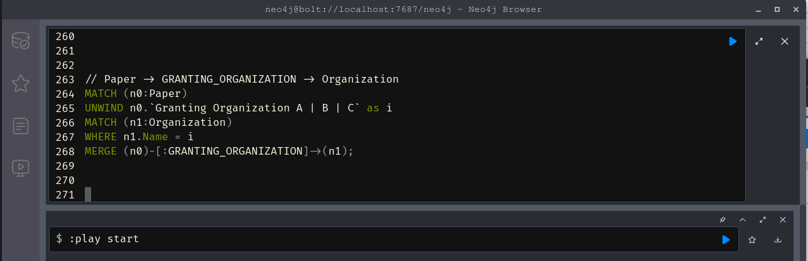

  4. Press the blue play/run button and this will import the rows of the csv as nodes in the graph

 ### Explore queries and visualizations
  1. Open neo4j Bloom the same way you opened the neo4j browser from neo4j desktop

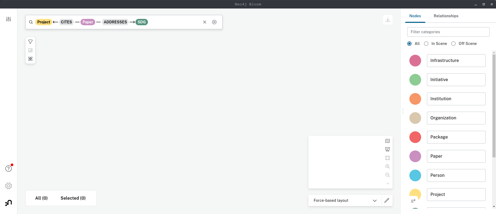

  2. Form your first query in the top left

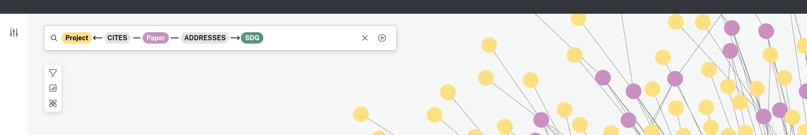

  3. Run it and see what happens! you can adjust max node count in setting in the bottom left

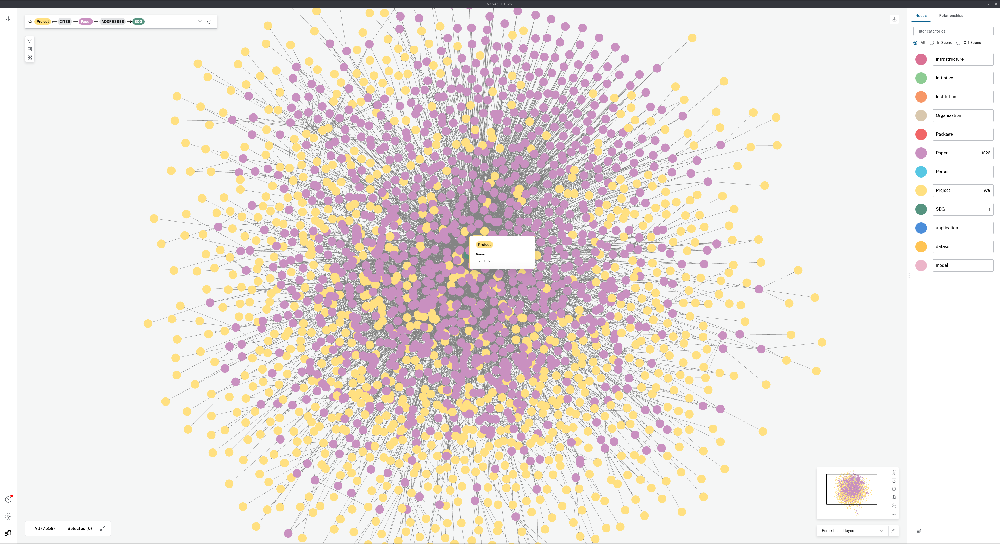

  3. If you add the graph data science plugin to your DBMS back in neo4j desktop, you can use those algorithms to change node size and other exciting things